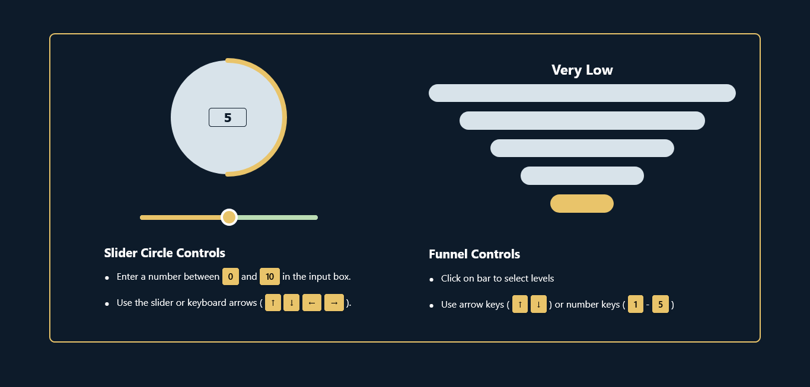

# Intellect Widgets Library

&#x20;&#x20;



**Intellect Widgets** provides two highly customizable, accessible React widgets:

- **SliderCircle**: A circular progress indicator with a debounced numeric input and slider.
- **FunnelScale**: A volume-style, event-delegated bar selector with semantic radio inputs.

## 📋 Table of Contents

1. [Getting Started](#-getting-started)
2. [Folder Structure](#-folder-structure)
3. [Widgets](#-widgets)
   - [SliderCircle](#slidercircle)
   - [FunnelScale](#funnelscale)
4. [Custom Hooks & Utilities](#-custom-hooks--utilities)
5. [Tests & Quality](#-tests--quality)
6. [CI & Deployment](#-ci--deployment)
7. [Contributing](#-contributing)
8. [License](#-license)

---

## 🚀 Getting Started

**Clone the repo**

```bash
git clone https://github.com/Tanveer-G/intellect-widgets.git
cd intellect-widgets
```

**Install dependencies**

```bash
npm install
# or
yarn install
```

**Run development server**

```bash
npm run dev
# or
yarn dev
```

**Run tests**

```bash
npm test
# or
yarn test
```

## 📂 Folder Structure

```
src/
├─ assets/           # Logos & images
├─ components/
│  ├─ Widgets/
│  │  ├─ Common/    # Shared instruction-guide layout
│  │  ├─ SliderCircle/
│  │  └─ FunnelScale/
│  └─ index.tsx     # Barrel export
├─ constants/       # Shared constants
├─ hooks/           # Custom React hooks (e.g. useDebounce)
├─ utils/           # Pure helper functions
├─ App.tsx          # Root component
└─ main.tsx         # Entry point
```

## 🧩 Widgets

### 1. Funnel Scale Widget

**Overview**  
A pyramid-shaped interactive control for selecting values from 1–5 (configurable) with:
- Clickable bars
- Keyboard navigation
- Screen reader support
- Dynamic width progression

**Key Features**
- **Visual Hierarchy**: Wider bars at the base for better click targets
- **Dual Input Modes**: Mouse + keyboard (arrows/numbers)
- **Accessibility First**: ARIA roles, live announcements
- **Performance**: Event delegation pattern
- **Customizable**: Via CSS modules

**Usage**:
```tsx
import { FunnelScale } from 'components/Widgets/FunnelScale';

function App() {
  return <FunnelScale />;
}
```

---

### 2. Slider Circle Widget

This widget consists of two modular components:

#### 2.1. CircleProgress Component

**Overview**  
An interactive circular progress indicator that combines visual feedback with direct numeric input. Features real-time SVG updates, input validation, and accessibility compliance:
- SVG-based visualization
- Input validation
- Debounced updates
- Responsive sizing

**Key Features**
- **Visual Feedback**: SVG circle fills proportionally to value
- **Debounced Input**: 300ms delay before propagating changes
- **Value Clamping**: Auto-adjusts to stay within min/max bounds
- **Accessibility**: ARIA attributes for screen readers
- **Responsive Design**: Pixel-perfect SVG scaling

```tsx
import { CircleProgress } from 'components/Widgets/SliderCircle';

function App() {
  const [value, setValue] = useState(5);
  return <CircleProgress value={value} onChange={setValue} />;
}
```

#### 2.2. RangeSlider Component Documentation

**Overview**  
A customizable range slider input with dynamic tooltip feedback and value validation. Features real-time progress visualization and accessibility-focused design:

**Key Features**
- **Dynamic Tooltip**: Shows current value during interaction
- **Value Clamping**: Automatically adjusts out-of-bound values
- **Accessibility**: Full ARIA compliance with screen reader support
- **Visual Feedback**: CSS-powered progress track
- **Validation**: Error messaging for clamped values

```tsx
import { RangeSlider } from 'components/Widgets/SliderCircle';

function App() {
  const [value, setValue] = useState(5);
  return <RangeSlider value={value} onChange={setValue} />;
}
```

---

## 🛠 Custom Hooks & Utilities

- ``: Debounced value hook.
- ``: Numeric clamp utility.
- **Circle/range/funnel utilities** in `src/utils/` for geometry and mapping logic.

## ✅ Tests & Quality (v2)

- **Jest** & **React Testing Library** for unit and integration tests.
- **axe-core** for accessibility checks.
- **ESLint** + **Prettier** + **Husky** + **lint-staged** for linting & formatting.

## ☁️ CI & Deployment (v2)

- **GitHub Actions** runs lint, type-check, build, and tests on every PR.
- **Storybook** (optional) for live component demos.
- Deploy to **Vercel** via CI hooks.

## 🤝 Contributing

1. Fork and clone this repo.
2. Create a feature branch: `git checkout -b feat/my-new-widget`.
3. Commit your changes with clear messages (`feat: add new widget`).
4. Push and open a PR.
5. Ensure CI passes and add tests for new code.

## 📄 License

This project is licensed under the **MIT License** - see the [LICENSE](LICENSE) file for details.

